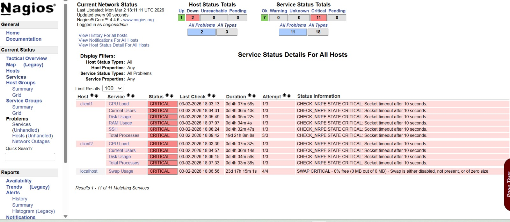

# Nagios AI Auto-Remediation Agent

AI-powered monitoring automation system that integrates with Nagios to detect incidents, analyze alerts, and perform safe automated remediation with Slack approvals.

## 🚀 Features

- Nagios alert ingestion
- AI-based alert analysis
- Slack alert notifications
- Safe auto-remediation playbooks
- Approval-based remediation
- Production-safe cleanup actions

## 🏗 Architecture

Nagios → Alert API → AI Analyzer → Slack → Playbook Engine → Auto Remediation

## ⚙️ Tech Stack

- Python
- FastAPI
- Nagios
- Slack Webhooks
- OpenAI API
- Linux Automation

## 📂 Project Structure
nagios-ai-agent │ ├── server.py # FastAPI alert receiver 
├── analyzer.py # AI alert analysis
├── playbooks.py # Auto-remediation engine 
├── slackbot.py # Slack alert notifications 
├── collector.py # Alert collection 
├── nagios_client.py # Nagios integration 
├── scan_cron.sh # Alert scanning cron job 
├── requirements.txt # Python dependencies 
└── host_mapping.json # Host mapping configuration

🔧 **Installation**
1️⃣ Clone the repository
git clone https://github.com/teppalalalit3-spec/nagios-ai-agent.git
cd nagios-ai-agent

2️⃣ Create Python virtual environment
python3 -m venv venv
source venv/bin/activate
Windows (Git Bash)
source venv/Scripts/activate

3️⃣ Install dependencies
pip install -r requirements.txt

4️⃣ Configure environment variables

Create .env file
OPENAI_API_KEY=your_openai_key
SLACK_WEBHOOK_URL=your_slack_webhook

5️⃣ Start the FastAPI server
python3 -m uvicorn server:app --host 0.0.0.0 --port 8000
Server will start on:
http://localhost:8000

🔒 **Safety Controls**
To prevent dangerous automation:
Only approved commands are executed
Uses non-interactive SSH
Requires Slack approval
Limited cleanup scope
No destructive operations

🧠 Future Improvements
Grafana dashboard integration
Kubernetes auto-remediation
ML-based anomaly detection
Incident timeline tracking
PagerDuty / Opsgenie integration

👨‍💻 **Author**
Lalit Kumar
NOC Engineer | Automation Enthusiast
Interested in SRE, Cloud Operations, and Monitoring Automation
GitHub
https://github.com/teppalalalit3-spec
    
